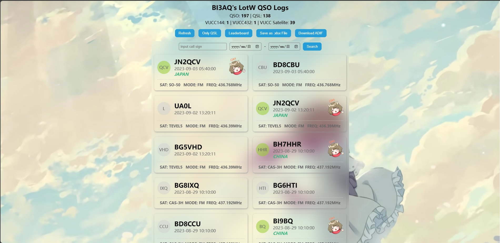

## LOTW QSOS LIST PAGE DEMO



 > 此为 LOTW QSOS LIST 的响应式前端页面 
 > 后端API: [kanoqwq/lotw-list-api (github.com)](https://github.com/kanoqwq/lotw-list-api)

## 功能

- 日志列表
- 本地日志搜索
- 日志详情
- qso记录表格导出
- ADIF文件下载
- 通联排行

用法(本地调试)：

```bash
npm i
npm start
```

打包：
```shell
npm run build
```

输出文件可在：`./build`内查看

FrontPage DEMO：[LotW status (kanokano.cn)](https://api.kanokano.cn/lotw-status/)

